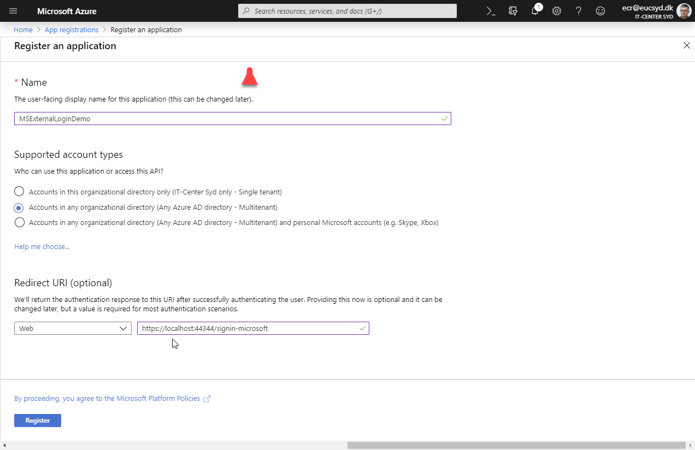

## 5. Microsoft External Login
[Microsoft Account external login](https://docs.microsoft.com/en-us/aspnet/core/security/authentication/social/microsoft-logins)

#### Installér MicrosoftAccount NuGet pakke
Installer `Microsoft.AspNetCore.Authentication.MicrosoftAccount` NuGet package til projektet.


#### Opret en app i Microsoft Developer Portal. 

Log ind på [Azure portal - App registrations](https://go.microsoft.com/fwlink/?linkid=2083908) skole-konto: ecr@eucsyd.dk.

---
Bemærk at man skal vælge 



#### Store the Microsoft client ID and client secret

Application (client) ID: findes under Overview
ClientSecret: findes under Certifcates & secrets.

Følgende er aktuelt benyttet i denne demo app og skal tilføjes ved at højre klikke på projektet og vælge
**Manage User Secret**s: 

Secret Manager:
```json
{
  "Authentication": {
    "Microsoft": {
      "ClientId": "<clientId>",
      "ClientSecret": "<clientSecret>"
    }
  }
}
```


#### Configuration i Startup.cs

Tilføj følgende kode til Configuration():

```c#
services.AddAuthentication().AddMicrosoftAccount(microsoftOptions =>
{
    microsoftOptions.ClientId = Configuration["Authentication:Microsoft:ClientId"];
    microsoftOptions.ClientSecret = Configuration["Authentication:Microsoft:ClientSecret"];
});
```

#### Login
Når der logges ind med Microsoft første gang bliver man præsenteret for en consent:

---


---


#### Hvad gemmes i databasen?
Her ses de to rows i databasen i AspNetUsers tabellen:

